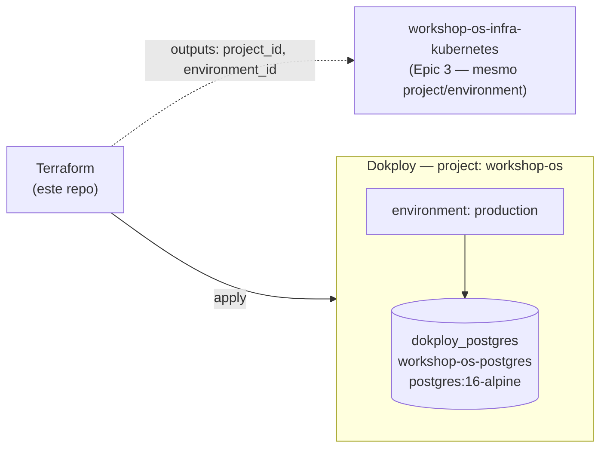

# workshop-os-infra-database

Terraform que provisiona o Postgres "gerenciado" do Workshop OS na Fase 3,
como recurso `Database` do [Dokploy](https://dokploy.com) — a plataforma de
nuvem escolhida para toda a Fase 3 (ver
[ADR-001](https://github.com/CandidoRPNeto/15SOAT-Fase1/blob/master/docs/architecture/adrs/adr-001-dokploy-as-cloud.md)
no repo principal).

Parte do split em 4 repositórios da Fase 3 do projeto
[15SOAT-Fase1](https://github.com/CandidoRPNeto/15SOAT-Fase1) — requisito
completo em [`evolucao_fase3`](https://github.com/CandidoRPNeto/15SOAT-Fase1/blob/master/evolucao_fase3),
decisão de escolha do provider/schema em
[RFC-002](https://github.com/CandidoRPNeto/15SOAT-Fase1/blob/master/docs/architecture/rfcs/rfc-002-managed-database-strategy.md).

## Propósito

Cria, via Terraform:
- `dokploy_project` (`workshop-os`) — projeto compartilhado com
  [`workshop-os-infra-kubernetes`](https://github.com/CandidoRPNeto/workshop-os-infra-kubernetes)
  (Epic 3), que anexa o recurso de app ao mesmo `project_id`/`environment_id`
  exportados aqui.
- `dokploy_postgres` (`workshop-os-postgres`) — banco `workshop_os`, imagem
  `postgres:16-alpine` (mesma versão usada em `docker-compose.yml`/`k8s/postgres.yaml`
  na Fase 2 do repo principal).

## Tecnologias

- Terraform `>= 1.5`
- Provider [`vanillauys/dokploy`](https://registry.terraform.io/providers/vanillauys/dokploy) `0.10.2`
  (comunitário, pré-1.0 — versão pinada; ver justificativa da escolha entre
  os forks disponíveis em RFC-002)

## Execução

```bash
export DOKPLOY_ENDPOINT="https://<seu-dokploy>.example.com"
export DOKPLOY_API_KEY="<sua api key — Settings > API/CLI no Dokploy>"
export TF_VAR_db_password="<senha do usuário workshop_os>"

terraform init
terraform plan
terraform apply
```

**Nota de rate limit**: a API do Dokploy responde `401` (não `429`) quando o
limite de requisições da API key é excedido — se um `apply` falhar com
`401` numa key que funciona para requisições isoladas, é provavelmente
limite de taxa, não credencial errada (ver guia "Getting started" do
provider).

**Status**: `terraform validate` passa; `apply` real ainda não foi rodado
nesta sessão — requer um servidor Dokploy acessível e credenciais do
usuário, que não fazem parte deste ambiente de desenvolvimento.

## Deploy

`main` e `homolog` protegidas (PR obrigatório). CI (`.github/workflows/ci.yml`)
roda `terraform fmt -check` + `terraform validate` em todo push/PR; o
estágio de `apply` automático fica para quando os secrets `DOKPLOY_ENDPOINT`/`DOKPLOY_API_KEY`/`TF_VAR_db_password`
estiverem configurados no repositório (mesmo padrão de gate condicional do
`ci-cd.yml` do repo principal, que só faz deploy quando `KUBE_CONFIG` existe).

## Diagrama de arquitetura



## Swagger / Postman

Não aplicável — este repositório é infraestrutura, não expõe API própria.
